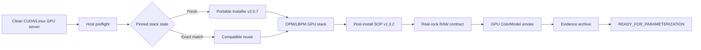

# LBPM Server Bootstrap

<div align="center">

**One-command, offline-first GPU server setup and validation for OPM/LBPM digital-rock simulations.**

Turn a clean CUDA/Linux GPU server into a validated OPM/LBPM environment with pinned dependencies, GPU runtime checks, post-install acceptance, and a real-rock smoke workflow.

[English](README.md) | [简体中文](docs/README.zh-CN.md)

[](https://github.com/Javis-101/lbpm-server-bootstrap/releases/tag/v1.0.3)
[](https://github.com/Javis-101/lbpm-server-bootstrap/actions/workflows/ci.yml)
[](LICENSE)


[](https://github.com/OPM/LBPM/commit/6d686d354e5b8140841d3601e4c8c0e4e4b77e48)
[](docs/validation/v1.0.3.md)

</div>

LBPM Server Bootstrap is an independent community project built around [OPM/LBPM](https://github.com/OPM/LBPM). It turns deployment readiness into an auditable engineering decision instead of treating a successful compilation as the finish line. It is not an official OPM project.

> [!IMPORTANT]
> **Want to deploy it? Use the [validated v1.0.3 GitHub Release](https://github.com/Javis-101/lbpm-server-bootstrap/releases/tag/v1.0.3) — do not clone `main` for the frozen deployment.**
>
> - `v1.0.3`: immutable, real-server-validated release
> - `main`: hardened `1.0.4-dev` development and audit source

⭐ If this project saves you time setting up or validating LBPM, consider [starring the repository](https://github.com/Javis-101/lbpm-server-bootstrap) — it helps other digital-rock researchers discover it.

## Quick start

The shortest validated path is: download the release, verify its identity, extract it, and run the bootstrap against one contract-compatible RAW file.

```bash
curl -LO https://github.com/Javis-101/lbpm-server-bootstrap/releases/download/v1.0.3/LBPM-server-bootstrap-v1.0.3.zip
curl -LO https://github.com/Javis-101/lbpm-server-bootstrap/releases/download/v1.0.3/LBPM-server-bootstrap-v1.0.3.zip.sha256

sha256sum -c LBPM-server-bootstrap-v1.0.3.zip.sha256
unzip LBPM-server-bootstrap-v1.0.3.zip
cd LBPM-server-bootstrap-v1.0.3

sudo bash run_all.sh \
  --raw /absolute/path/to/your_rock.raw
```

Expected archive identity:

```text
f1bf6e5649769aba5d246535d3f74f1cbc4032ebab78ee9bb54fa7a439360507  LBPM-server-bootstrap-v1.0.3.zip
```

Run it as root on a compatible Ubuntu-like x86_64 GPU server. The host must already provide the required compiler toolchain and CUDA runtime; the bootstrap deliberately does not alter APT sources or install missing operating-system packages. Read [compatibility](docs/compatibility.md) before renting or preparing a server.

## What's inside?

The Git repository contains reviewable installer and SOP source. The complete offline payload is distributed only in the [v1.0.3 Release asset](https://github.com/Javis-101/lbpm-server-bootstrap/releases/tag/v1.0.3), not in Git history.

```text
LBPM Server Bootstrap v1.0.3
|
+-- Portable Offline Installer v2.0.7
|   +-- OpenMPI 4.1.8
|   +-- zlib 1.3.2
|   +-- Parallel HDF5 1.14.6
|   +-- OPM/LBPM v2026.04
|   `-- audited local patch
|
+-- Post-install SOP v1.3.2
|
`-- Bootstrap orchestration
    +-- environment checks
    +-- fresh install or exact compatible reuse
    +-- GPU acceptance
    +-- RAW contract and real-rock smoke workflow
    `-- bounded evidence generation
```

- [`installer/`](installer/) is the **Portable Installer source**, manifests, patch, and tests.
- [`sop/`](sop/) is the **post-install SOP source** and acceptance workflow.
- `packages/LBPM-portable-offline-installer.zip` and `packages/LBPM-postinstall-SOP-v1.3.2.zip` are embedded in the complete v1.0.3 Release ZIP.

This separation keeps large third-party source archives out of Git while preserving reviewable scripts, checksums, patches, policies, and tests.

## Real-server validated

The immutable v1.0.3 archive completed both a fresh installation and an exact compatible-reuse run on a real NVIDIA Tesla T4 server. The public [validation record](docs/validation/v1.0.3.md) retains the reproducibility-relevant environment and results while excluding private host identity and research-data details.

| Validated component | Environment |
| --- | --- |
| Operating system | Ubuntu 24.04.x, x86_64 |
| GPU / CUDA | NVIDIA Tesla T4 / CUDA 12.8 |
| Compiler | GCC, G++, and GFortran 13.x |
| MPI / HDF5 | OpenMPI 4.1.8 / parallel HDF5 1.14.6 |
| OPM/LBPM | v2026.04, commit `6d686d354e5b8140841d3601e4c8c0e4e4b77e48` |

| Validation gate | Result |
| --- | --- |
| Fresh installation | ✅ PASS |
| Exact compatible reuse | ✅ PASS |
| LBPM identity | ✅ PASS |
| CUDA/GPU runtime and Piston acceptance | ✅ PASS |
| Real-rock RAW contract and +Z connectivity | ✅ PASS |
| Source immutability and ROI preservation | ✅ PASS |
| GPU ColorModel smoke run | ✅ PASS |
| Evidence generation / `READY_FOR_PARAMETERIZATION` | ✅ PASS |

These are engineering validation results. No synthetic benchmark throughput, solver accuracy metric, or production-physics claim is inferred from them.

## Why use this instead of setting up LBPM manually?

OPM/LBPM remains the upstream simulation software. This project automates a bounded deployment and acceptance workflow around it; the comparison is between operating workflows, not project quality.

| Capability | Manual LBPM setup | Typical install script | LBPM Server Bootstrap |
| --- | --- | --- | --- |
| Dependency and upstream commit pinning | Operator-managed | Varies | ✅ Recorded and checked |
| Offline-first installation | Manually assembled | Sometimes | ✅ Release payload |
| SHA256 source identity | Manual | Varies | ✅ Fail-closed |
| CUDA/GPU runtime acceptance | Separate checks | Usually limited | ✅ Integrated |
| LBPM commit and patch identity | Manual | Varies | ✅ Verified |
| Fresh install / compatible reuse decision | Manual | Varies | ✅ Explicit |
| Real digital-rock RAW contract | Separate workflow | Rare | ✅ Integrated |
| Source immutability and ROI checks | Manual | Rare | ✅ Integrated |
| Bounded evidence archive | Manually assembled | Rare | ✅ Generated |

The result is most useful when reproducibility, short-lived infrastructure, or an auditable handoff matters more than an ad hoc one-time build.

## Architecture



Each failed stage stops dependent work but still attempts a bounded failure summary and evidence archive. See the deeper [architecture](docs/architecture.md) and [evidence contract](docs/EVIDENCE-CONTRACT.md).

## Who is this for?

- digital-rock researchers using OPM/LBPM;
- researchers renting short-lived CUDA GPU servers;
- teams that need reproducible LBPM setup and installation records;
- porous-media, lattice Boltzmann method (LBM), and scientific-computing users;
- groups generating simulation datasets from controlled environments;
- operators who need auditable installation, validation, and failure evidence.

It is not a universal installer for every Linux distribution, CUDA release, GPU, or LBPM configuration. The validated profile is deliberately narrow.

## Offline-first workflow

The Portable Installer verifies pinned OpenMPI, zlib, HDF5, OPM/LBPM, and local-patch identities before building. Its default path uses the archives embedded in the v1.0.3 payload. An explicit network fallback may acquire only the pinned sources when an archive is absent; it must not silently substitute newer versions.

This design supports air-gapped or bandwidth-constrained GPU servers and reproducible research handoffs. For payload assembly rules and source provenance, see [offline mode](docs/offline-mode.md) and [dependency identities](docs/dependencies.md).

## What it validates

The bootstrap checks the server, software stack, data contract, and evidence boundary together:

- package/source SHA256, compiler, GNU Fortran linkage, CUDA, MPI, HDF5, LBPM commit, and patch identity;
- fresh installation versus exact compatible reuse;
- visible GPU binding and lightweight Piston/runtime acceptance;
- one 128 × 128 × 128 uint8 RAW with `0=solid`, `1=pore`, flow axis `+Z`, and 1.0 µm voxels;
- label semantics, six-neighbour +Z spanning connectivity, immutable source copies, and scientific ROI preservation;
- a bounded GPU ColorModel numerical smoke run;
- machine-readable summaries, stage logs, evidence inventory, archive, and sidecar SHA256.

A failed rock is rejected. The workflow does not repair, filter, relabel, or silently crop research data.

## Scientific boundary

Passing Bootstrap/SOP validation means the infrastructure, LBPM build, GPU runtime, data contract, and smoke simulation are engineering-ready.

It does **not** constitute physical validation of final production water-displacing-gas simulations, residual gas saturation, capillary-number selection, wettability models, or scientific parameterization. `READY_FOR_PARAMETERIZATION` is an engineering handoff state, not a physical-model certification, and the real-rock smoke workflow must not be described as a physically validated reservoir simulation.

## Output and evidence

Every run gets a unique directory containing state, per-stage logs, host/runtime identity, validation reports, a bounded evidence archive, and a sidecar SHA256. Public evidence intentionally excludes source/final RAW, intermediate simulation RAW, Restart/HDF5/build trees, credentials, private host identifiers, and unredacted absolute paths.

The source checkout also includes static publication gates for reviewers and contributors:

```bash
python3 -m unittest discover -s tests -p 'test_*.py'
bash tests/test_installer_path_safety.sh
python3 scripts/publication_gate.py .
```

GitHub-hosted CI is static. It does not bind an NVIDIA GPU and is not a substitute for real-server validation.

## Compatibility

The frozen v1.0.3 profile targets Ubuntu-like x86_64 Linux, root execution, one visible NVIDIA GPU, an installed CUDA toolkit, GCC/G++/GFortran with a working `-lgfortran` link, CMake 3.24 or newer, and the pinned dependency stack shown above. `MPI_RANKS=1` is part of the validated real-rock smoke profile.

Review the full [compatibility matrix](docs/compatibility.md) before selecting a host. Repository `main` includes a later fail-closed installer-path guard and therefore remains `1.0.4-dev`; it is not represented as the frozen v1.0.3 artifact and requires fresh real-server validation before a future release.

## Repository layout

```text
bin/                 bootstrap contracts and evidence helpers
installer/           Portable Installer source, patch, and manifests
sop/                 post-install acceptance and real-rock workflow source
packages/            payload policy only; no archives tracked in Git
docs/                architecture, compatibility, validation, and operations
scripts/             publication gates
tests/               bootstrap and publication regression tests
.github/workflows/   lightweight static CI
```

Copy `bootstrap.env.example` to the ignored `bootstrap.env` only when configuration is needed. Use neutral absolute Linux paths and never commit credentials, SSH details, server identifiers, or research-data locations.

## Troubleshooting

Common blockers are missing GNU Fortran linkage, invisible CUDA devices, archive/checksum mismatch, an incompatible existing stack, an invalid installation prefix, or a RAW contract failure. Do not rename archives to bypass identity checks or overwrite a mismatched stack. The [troubleshooting guide](docs/troubleshooting.md) lists bounded checks and safe recovery directions.

Security-sensitive reports belong in a private vulnerability report or Security Advisory when available; see [SECURITY.md](SECURITY.md).

## Community

- Questions and setup help → [GitHub Discussions](https://github.com/Javis-101/lbpm-server-bootstrap/discussions)
- Reproducible bugs → [GitHub Issues](https://github.com/Javis-101/lbpm-server-bootstrap/issues)
- Feature ideas and workflow proposals → [GitHub Discussions](https://github.com/Javis-101/lbpm-server-bootstrap/discussions)
- Code and documentation contributions → [CONTRIBUTING.md](CONTRIBUTING.md)

When reporting a problem, include the affected version or commit, operating environment, minimal reproduction, and whether the failure occurred in static checks or on a real NVIDIA GPU server. Never attach credentials, private server details, or research RAW files.

## Citation

If this workflow supports published research, cite both LBPM Server Bootstrap and the upstream OPM/LBPM project. Repository citation metadata is provided in [CITATION.cff](CITATION.cff). The citation version follows the repository source (`1.0.4-dev` on `main`); the validated deployment remains the separately identified v1.0.3 Release.

## License

Repository-authored material is licensed under `GPL-3.0-only`. Third-party components retain their own licenses. See [LICENSE](LICENSE) and [THIRD_PARTY_NOTICES.md](THIRD_PARTY_NOTICES.md).

## Acknowledgements

This work relies on [OPM/LBPM](https://github.com/OPM/LBPM), Open MPI, zlib, HDF5, CUDA-capable systems, and the maintainers and contributors of those projects. Their inclusion does not imply endorsement or official affiliation.
